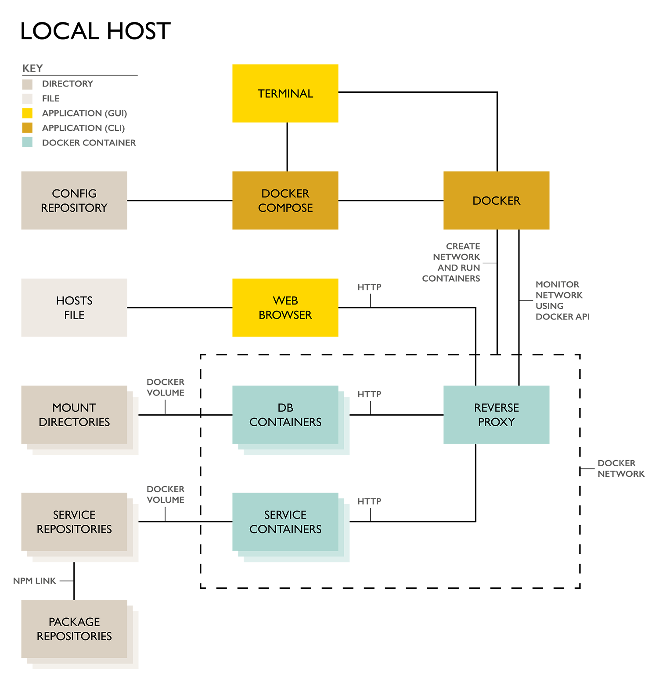

# Documentation for Base

This is a base for any micro-services application. It is designed to be forked and used as the basis for a new application.

The goal is to provide:

- Solid architecture
- Suite of useful services and packages
- Guidelines for development and testing workflow
- Documentation including diagrams

---

* [Architecture](#architecture)
    * [Config](#config)
    * [Services](#services)
        * [Reverse Proxy](#reverse-proxy)
        * [Front End](#front-end)
        * [Backend HTTP Services](#backend-http-services)
            * [Contentful Cache](#contentful-cache)
            * [Strapi](#strapi)
            * [Static File Server](#static-file-server)
        * [Backend Database Services](#backend-database-services)
            * [MySQL](#mysql)
    * [Volumes](#volumes)
    * [Code Library](#code-library)
* [Development](#development)
    * [Local Directory Structure](#local-directory-structure)
    * [Forking](#forking)
    * [Repositories](#repositories)
    * [Naming Conventions](#naming-conventions)
    * [Using Volumes in Development](#using-volumes-in-development)
    * [Prepare Dev Environment](#prepare-dev-environment)
    * [Start App on Local Host](#start-app-on-local-host)
    * [Develop a Feature or Fix a Bug](#develop-a-feature-or-fix-a-bug)
    * [Working On Multiple Services](#working-on-multiple-services)
    * [Working with Dependency Packages](#working-with-dependency-packages)
* [Testing](#testing)
    * [Set Up Test App on Local Host](#set-up-test-app-on-local-host)
    * [NPM Package Testing](#npm-package-testing)
* [Glossary](#glossary)
    * [Versioning and Tagging](#versioning-and-tagging)
    * [Semantic Versioning](#semantic-versioning)
    * [GitFlow Branching Strategy](#gitflow-branching-strategy)
        * [Master Branch](#master-branch)
        * [Release Branch](#release-branch)
        * [Develop Branch](#develop-branch)
        * [Feature Branch](#feature-branch)
        * [Bug Branch](#bug-branch)
        * [Hotfix Branch](#hotfix-branch)
    * [NPM Packages](#npm-packages)
        * [Source Code](#source-code)
        * [Distribution Code](#distribution-code)
        * [Security](#security)
        * [Versioning](#versioning)
        * [NPM JS](#npm-js)
        * [NPM Tagging](#npm-tagging)
        * [NPM Link](#npm-link)
    * [Docker](#docker)
        * [Containers](#containers)
        * [Images](#images)
        * [Images vs containers](#images-vs-containers)
        * [Commit vs Dockerfile](#commit-vs-dockefile)
        * [Build](#build)
            * [Build Arguments](#build-arguments)
            * [Build Cache](#build-cache)
        * [Microservices](#microservices)
        * [Docker Compose](#docker-compose)
            * [docker-compose.yml](#docker-compose.yml)
            * [Basic commands](#basic-commands)
            * [docker-compose.yml example](#docker-compose.yml-example)
            * [docker-compose.yml properties](#docker-compose.yml-properties)
        * [Useful commands](#useful-commands)
        * [Docker Hub](#docker-hub)
        * [Conclusion](#conclusion)
---

## Architecture

This application uses a Docker micro-services architecture. This approach is highly modular but it is relatively complex. It consists of a group of networked Docker containers that are called services. Each service is there to do a specific job.

Some of the advantages of a Docker-bsed micro-services architecture are:

* Language agnostic. You can use any language and any framework, as long as there is an HTTP API.
* Clear responsibility and ownership. One team can be reponsible for a specific micro-service.
* Scaling. You can run multiple, load-balanced clones of a container for each service. This means that, in production, each service can repond to demand independently, by increasing or decreasing resources, ensuring 'just-enough' performance and optimising costs.

### Local Host

The following diagram shows an abstraction of this application's architecture when being developed on a local host machine



### Config

'Config' is just some config files used to start up the application. It consists of

1. Docker Compose yml files
    * Used to bootstrap the app, including downloading and caching the Docker image for each service, running one or many containers from each image and networking the containers on a Docker network
    * There are different yml files for development, testing and production
2. Environment variables for each service

For development we are using Docker Compose as a tool to run and network Docker containers and build images on a single local host.

We plan to change to using Kubenetes, which is a full container cluster management and orchestration tool. This would make the development environment more compatible with a production environment on AWS or Digital Ocean.

### Services

Services are [Docker](#docker) containers that contain one, well defined part of an application. Each service has an HTTP API and they communicate with each other over a network. Using Docker Compose and the code in [Config](#config) you can, with just one command, download all the required images, run containers from the images and network the containers. In other words you can start the application and see it running in your browser.

The Git repository for each service includes a `Dockerfile` to build a Docker image. Docker Images can be stored on Docker Hub, a repository for Docker images. Docker Hub can be easily configured to build images automatically from code stored in GitHub using webhooks. Using this method commits or tags pushed to GitHub will trigger a Docker image build on Docker Hub.

Services in this application include:

1. One Reverse Proxy
2. One Front End
3. Many Backend Services

#### Reverse Proxy

The reverse proxy sits at the 'front' of the application as a sort of gatekeeper. When an HTTP(S) request arrives on the host computer, it is forwarded to the reverse proxy service in the application. The reverse Proxy then forwards the request to one of the other services, typically based on the URL, domain and/or port.

For example, the reverse proxy might be set up to forward all requests for www.mydomain.com on port 80/443 to the front end service, and all requests for admin.mydomain.com on post 80/443 to the CMS service.

It also enables and manages HTTP requests between services inside the application on the Docker network.

The reverse proxy service is a nginx server inside a docker container. It uses the Docker API to query the Docker network. By doing this it can understand what services exist and dynamically generate an appropriate nginx config file.

It can also provide load balancing, caching, compression and other useful utilities.

#### Front End

A simple backend Node server which serves a front end React application for ALL requests to the www subdomain. The React app is a single minified HTML file with browser-safe, inline JavaScript and CSS.

The React app handles all URL-based routing, using React Router and application state with Redux.

Server Side rendering is not necessary as long as you follow some simple rules:

1. All URLs must render without asynchronous, client side server calls. Search engines can handle javascript rendering but it won't wait to see what _might_ render
2. You manage Search Engines' expectations using a sitemap and webmaster tools for each Secrach Engine, such as Google Search Console, to check indexing status and optimize visibility

Even a front end service needs a simple backend web server and it would be quite easy to extend the routing on this web server include API endpoints on /api, whilst serving the front end app on other urls. Mixing the front end app and backend API like this is quite common, but using a Docker micro-services architecture allows us to keep things completely modular, so we prefer to keep the front end as simple as possible and delegate API responsibilities to other services.

#### Backend HTTP Services

Backend HTTP services have:

1. Web Server
2. RESTful API

The API is exposed to other backend http services on the local Docker network via the Reverse Proxy.

It might also need to be exposed to the internet. Common reasons for this would be:
1. It is used by the front end service after the front end app has been served i.e. by the web browser
2. It needs to receive POST requests from a 3rd party SaaS app (web hooks)

##### Contentful Cache

Contentful is a SaaS headless CMS. This service caches content from a Contentful account and makes it available to the Front End service. 

The purpose is to provide an API for the Front End to use that is much faster than making API calls directly to Contentful.

It has 3 main features

1. Content In
    - An API to allow Contentful to POST data
    - This happens using web hooks set up in Contentful. When content is added or changed Contentful POSTs the changes to   
2. Content Out
    - An API to allow the Front End service to GET data
3. Admin
    - An API to reset/rebuild the cache and other utilities

The cached content is stored in a mySQL database in a mySQL service. Therefore, this service is an API between a mySQL service and other services, both internal (Front End) and external (Contentful)

Performance is significantly better than making API call directly to Contentful because:

1. The API and the MySQL tables are customised for the needs of this application. This means that:
    1. There is no need for multiple API calls, complex database queries or unnecessary processing
    2. JSON responses are formatted to be convenient for the front end
2. We are in control of hardware performance. It is not affected by performance issues or outages on Contentful's CDN. We can dedicate as many resources as needed to make this service performant. 

An additional benefit of the cache is that API calls directly to Contentful are rarely needed. Contentful seem to change their price plans regularly but they are sometimes based on the number API calls, in which case one of the cheaper plans can be used.

Data is stored in the MySQL container, not [Volumes](#volumes), as it does NOT need to persist between application restarts (the real data is stored on Contentful's SaaS platform and can easily be re-cached).

##### Strapi

Strapi is an open source headless CMS that allows you to easily create APIs to fetch the content. 

It has advantages and disadvantages over Contenful.

Advantages

1. It's free
2. Open Source mean complete access to and control over the code base
3. No need for seperate local cache and API
4. You can create GraphQL APIs to make powerful API queries possible with a single request. No more over and under fetching.

Disadvantages
1. Version 3 is still in beta and can be buggy
2. Less well designed in terms of flexibility and relationships between content
3. UI is not as slick
4. Less mature in general

##### Static File Server

A simple Nginx file server, to serve any asset. You may prefer to use a cloud asset server like AWS S3 or Digital Ocean Object Storage.

#### Backend Database Services

A MySQL container run from an image taken staight from DockerHub. 

Data can be optionally stored in a directory on the host computer i.e. NOT in the container. This method allows data to  persist between restarts and is achieved by using Docker [Volumes](#volumes) when the constainer is run (the same method that allows code to be edited during development).

##### MySQL

A MySQL container run from an image taken staight from DockerHub. 

Data can be optionally stored in a directory on the host computer i.e. NOT in the container. This method allows data to  persist between restarts and is achieved by using Docker [Volumes](#volumes) when the constainer is run (the same method that allows code to be edited during development).

### Volumes

A volume is simply a directory on the host machine that can be accessed from inside a container.

In terms of applilcation architecture, it is used to store data that needs to persist between application restarts i.e. is stored on a hard drive, not in RAM.

Typically this means that a DB Service (container) will use a volume on the host machine to store its data.

This can also be accomplished using a service from your cloud infrastructure provider e.g. AWS "EBS Volume", or Digital Ocean "Block Storage Volume" - you can mount a volume completely outside your host machine to its /mnt directory and from there, mount it to the container. This is a very flexible and safe way to keep valuable data available to a Docker-based micro-services application.

Volumes are also essential when developing using containers. [Using Volumes in Development](#using-volumes-in-development)

### Code Library

Code that is re-usable across more than one service is stored in a private library of JavaScript [NPM](#npm) packages. Source code for these packages is stored on GitHub and distribution code is published to npmjs.com.

You might say that these NPM packages are part of the 'development architecture' rather than application architecture, as they are added to services during the build process and, as such, are not easily distinguishable from the service whwn the application is running.

---

## Development

### Repositories

#### GitHub

The repositories for Base are:

* https://github.com/natdarke/base-config
* https://github.com/natdarke/base-service-front-end
* https://github.com/natdarke/base-service-contentful-cache
* https://github.com/natdarke/base-service-static-files


These repos are meant to be forked for every new app. Therefore, when you create a new app, you should end up with that look like this:


* https://github.com/[account-name]/[app-name]-config
* https://github.com/[account-name]/[app-name]-service-front-end
* https://github.com/[account-name]/[app-name]-service-contentful-cache
* https://github.com/[account-name]/[app-name]-service-static-files

#### DockerHub

Base uses 2 types of service.

1. Our own
2. 3rd party

For each of our own services there is an image on DockerHub:

* https://cloud.docker.com/repository/docker/natdarke/base-front-end
* https://cloud.docker.com/repository/docker/natdarke/base-contentful-cache
* https://cloud.docker.com/repository/docker/natdarke/base-static-files

When you fork Base you will need to create new repositories for each service

* https://cloud.docker.com/repository/docker/[account-name]/[app-name]-front-end
* https://cloud.docker.com/repository/docker/[account-name]/[app-name]-contentful-cache
* https://cloud.docker.com/repository/docker/[account-name]/[app-name]-static-files

#### NPM

We distinguish between 2 [types of NPM package](#package-types)

1. Root Packages
2. Dependency packages

Only dependency packages are published to NPM

https://www.npmjs.com/package/[unique-package-name]

### Naming Conventions

#### Docker Compose Service Name

`[service-name]`

#### Docker Compose Virtual Host (env var)
`[service-name].[app-name]`

#### /etc/hosts

`[service-name].[app-name]`

#### GitHub repos

* For a Config

    `[app-name]-config`

* For a Service

    `[app-name]-service-[service-name]`

* For a Dependency Package

    `[unique-package-name]`

    > This will be the same name as used in the package.json and in the npm repo

#### DockerHub repo

`[app-name]-[service-name]`

> This will be the same as the GitHub repo but without the word "service" in the middle, as all our Docker Images are services


#### NPM Packages (package.json name)

* Root Package for a Service

    `[app-name]-root-[service-name]`
    > Note this differs slightly from the GitHub repo name and the DockerHub repo names for this service

* Dependency Package

    `[unique-package-name]`

    > This will be the same name as used in the GitHub repo and in the npm repo

#### NPM repos

* Dependency Package

    `[unique-package-name]`
    > This will be the same name as used in the GitHub repo and in the package.json

### Local Directory Structure

> This application and documentation assumes the following directory structure during development. 

```
[app-name]/[repository-name]
```

The `[app-name]` diectory can be anywhere. e.g.

```
~/dev/[app-name]/[repository-name]
```

Repositories should follow the following naming convention:

```
[app-name]-config
[app-name]-service-[service-name]
[app-name]-package-[dependency-package-name]
```
### Forking

When creating a new application based on this one you need to do the following. 

1. [Prepare Dev Environment](#prepare-dev-environment)
    * Replacing 'base' with the new app name where relevant

2. Create an 'new app directory'
    
    * Create a new directory for the new app in your development directory (using the guide in [Local Directory Structure](#local-directory-structure)). This will contain local repos for the config and each service

3. For the [Config](#config) AND each of the [Services](#services)

    1. In the 'new app directory' created in step 2, Git clone the base app repo for the config or service you want to fork

    2. Rename the cloned repo directory created in step 3.1

        From 
        * `base-config` or 
        * `base-service-[service-name]`
        
        To
        * `[app-name]-config` or 
        * `[app-name]-service-[service-name]`

    3. Create a new remote repository in GitHub, with the same name as the renamed repo directory in step 3.2

    4. Change the remote repo address
    
        * In the renamed repo directory in step 3.2
    
            `git remote set-url origin [new remote repository url]`

    6. If this is a service (not the config) change the app name in package.json to be `[app-name]-root-[service-name]` and commit to master branch

    7. Branch `master` to `develop`

    8. Push the `master` and `develop` branches to the new repo 
    
        * `git push origin master`
        * `git push origin develop`

3. Link your DockerHub account to your GitHub account to allow automatic builds

4. For each of the [Services](#services)
    1. Create a new repo in [DockerHub](#dockerhub)
    2. Configure automated builds from GitHub for the master and develop branches

5. In [Config](#config) change the image names in all .yml files to relect the new images on DockeHub

6. Create a new space in Contentful

7. In Contentful > [new space] > Space Settings > General Settings, make a note of the Contentful 'Space name' and 'Space ID' and use in step 9

8. In Contentful > [new space] > Space Settings > API Keys > Add API Key, create a 'Content Delivery API - access token' and use in step 9

9. Copy [Config](#config) > /environment-example/ to /environment/ and change the values following the hints inside. /environment/ is listed in .gitignore and it should stay that way i.e. make sure you don't commit them.

10. For each service add 'virtual host' names to /etc/hosts

    ```
    127.0.0.1       [service-name].[app-name]
    ```


### Using Volumes in Development

* It is very inconvenient to work on code inside a container during development, not least because it is a purely CLI environment

* A developer can mount a volume from their local machine inside a container, thereby allowing them to work on local code but have that code used within an application container/service

* Docker Compose provides a convenient way to do this in a yml file

* During devlopment you clone [Repositories](#repositories) and mount them by specifying the path to the repo in [Config](#config)


### Prepare Dev Environment

> This process should also be used for testing

1. Install and Configure Git
    ```
	sudo apt-get install git

    sudo git config --global user.name "Your Name"

    sudo git config --global user.email "name@domain.com"
    ```

2. Install Docker following these instructions:
    * Linux Ubuntu: https://docs.docker.com/install/linux/docker-ce/ubuntu/
	* Windows: https://docs.docker.com/docker-for-windows/install/
	* Mac: https://docs.docker.com/docker-for-mac/install/

3. Install Docker Compose following these instructions:
	https://docs.docker.com/compose/install/
 
4. Map The Virtual Host to Local Host for Each Service.

    * In /etc/hosts, add the following lines
	
        ```
        127.0.0.1    front-end.[app-name]
        127.0.0.1    contentful-cache.[app-name]
        127.0.0.1    static-files.[app-name]
        ```
  
5. Create a GitHub account and ask us to add it to the Base organisation

	> You will now be able to view the Base repositories

6. Set up SSH keys on your GitHub account 
	
    * https://help.github.com/articles/adding-a-new-ssh-key-to-your-github-account/ 
    * Use tabs at the top of the page to select Mac/Windows/Linux and follow the instructions

    > You will now be able to clone the Robot repositories using the SSH protocol without giving a password

### Start App on Local Host

> This process should also be used for testing

1. Clone 'Config' from GitHub.
    
    > 'Config' is just the Docker Compose config files and environment variable files that allow you to start the app.
	
    ```
    mkdir -p [dev-directory]/[app-name]
    
    cd [dev-directory]/[app-name]

    git clone git@github.com:natdarke/[app-name]-config.git
    ```
    This creates a directory called `[app-name]-config`

2. Use Docker Compose to start the app
	
    * #### For Development
        ```
        cd [dev-directory]/[app-name]/[app-name]-config

        sudo docker-compose -f docker-compose.dev.yml up -d
        ```
    * #### For Regression Testing and UAT
        ```
        cd [dev-directory]/[app-name]/[app-name]-config

        sudo docker-compose -f docker-compose.test.yml up -d
        ```
    * #### For feature Testing
        > This file needs to be created and deleted by the developer, per feature
        ```
        cd [dev-directory]/[app-name]/[app-name]-config

        git fetch

        git checkout feature/[feature-name]

        git pull feature/[feature-name]

        sudo docker-compose -f docker-compose.test.yml up -d
        ```
	
    > This might take a few minutes, as some (or all) of the Docker images may have to be downloaded from Docker Hub, before the container can be created from them.

	> You will see how the progress of each container. When it is finished you will see a confirmation message
	
3. View the working app 

    * In your browser go to `front-end.[app-name]`

	> You should see the application working

4. Now you are ready to build a feature, fix a bug or test

### Develop a Feature or Fix a Bug

Developing a feature involves complex processes for collaboration, building and deployment. Git, GitHub, NPM, NPM JS, Docker, Docker Compose and Docker Hub all play their part 

* Assumptions

    * The application is working on your local machine, following the instructions in 
        * [Prepare Dev Environment](#prepare-dev-environment) and 
        * [Start an App on Local Host](#start-an-app-on-local-host)
    * The feature only requires work on 1 service. If you your feature requires that you work on more than one service, see [Develop with Multiple services](#develop-with-multiple-services)
    * You don't need to work on any NPM packages. If you do, see [Working with Dependency Packages](#working-with-dependency-packages)

1. Clone the service 

    * You only need to clone the service you need to work on
    
    * The [naming convention](#naming-conventions) for service repositories is `[app-name]-service-[service-name]`. Henceforth, they will be referred to as `[service-repo-name]`

    * If you HAVE NOT cloned this service before

        1. Clone the service you need to work on
            
            ```
            mkdir -p ~/[dev directory]/[app-name]
            
            cd [dev-directory]/[app-name]

            git clone git@github.com:natdarke/[app-name]-service-[service-repo-name].git

            ```
            `clone` will create a new directory called `[service-repo-name]`
        2. `npm install`
        3. Fetch remote branches and checkout develop
            ```
            cd [dev-directory]/[app-name]/[service-repo-name]
            git fetch
            git checkout develop
            ```

    * If you HAVE cloned this service before
        
        1. Make sure the develop branch exists locally and is up to date
            ```
            cd [dev-directory]/[app-name]/[service-repo-name]
            git fetch
            git checkout develop
            git pull develop
            ```
            If you have followed the [GitFlow Branching Strategy](#gitflow-branching-strategy) there will NOT be a merge conflict.
        2. `npm install`

2. Create a feature branch from the develop branch and check it out
	
    ```
    git checkout develop
    
    git branch feature/[feature name]

    git checkout feature/[feature name]
    ```
    > base the feature name on the story or task name/id

3. Enable volumes

    In `docker-compose.dev.yml` enable the `volume` for the service you need to work on, by removing the `#` comment on 2 lines

    **_Do not commit these changes in Git. Discard all changes after development. **

    For example, if the service you need to work on is `static` then you need to change
    ```
    static-files:
        image: natdarke/[app-name]-static-files
        # volumes:
        #  - "..//[app-name]-service-static-files/src:/var/www"
        ports: 
        - "5003:80"
        environment:
        - environment/dev/static-files.env
    ```
    to
       
    ```
    static-files:
        image: natdarke//[app-name]-static-files
        volumes:
        - "..//[app-name]-service-static-files/src:/var/www"
        ports: 
        - "5003:80"
        environment:
        - environment/dev/static-files.env
    ```
    > The path before the colon (e.g. `..//[app-name]-service-static-files/src`) is a relative path to the source code of the service you checked out from GitHub, so make sure your directory structure is reflects this.

4. Start / Re-Start the application

    ```
    cd [dev-directory]/[app-name]/[app-name]-config

    sudo docker-compose -f docker-compose.dev.yml down

    sudo docker-compose -f docker-compose.dev.yml up -d
    ```

5. Develop

    Make code changes on this branch and commit each change until the task is complete
    
    ```
    git commit -am "Description of change"
    ```

    To see any changes you must have cloned the service and mounted it as a `volume` in the `docker-compose.dev.yml` file (see stages 1-3)

    If you are working on the front end service you will be able to see you change immediately

    > This because React uses a special development server that listens to, and serves, the uncompiled source code

    #### Changing NPM dependency packages

    You may realise that the code you need to change is, in fact, part of an NPM package. If this is the case:
    
    1. Follow the instructions in [Working with Dependency Packages](#working-with-dependency-packages)
    2. ##### When you have finished working on the dependency package
        * Update the version number of the package in the service's package.json file
        * In other words change `[dev-directory]/[app-name]/[service-repo-name]/package.json` to use the exact version in `[dev-directory]/[app-name]/[package-repo-name]/package.json` e.g. `1.1.0`
    3. Commit the version number change
        ```
        git commit -am "Version number change for dependency package [package-repo-name]"
        ```

6. Push the feature branch

    ```
    git push origin feature/[feature name]
    ```

7. Create a feature tag
    * The purpose of tagging 2 fold:
        1. To indicate that a commit represents to completion of a feature, subject to testing
		2. To trigger an image build in Docker Hub, tagged with the same name
	* Tag your latest commit:
        
        ```
        git tag -a feature-[feature name]-1 -m "Feature [feature name] is ready for testing"
        ```

        > Incrament the tag number by one each time this feature needs to be tested 
	* Or tag a commit by id: (only do this if, for some reason, your latest commit is not the commit that completed this feature)
        ```
        git tag -a feature-[feature name]-1 [commit-id] -m "Feature [feature name] is ready for testing"
        ```
	    > Be careful not to give your tag the same name as the branch. It will cause errors.

        > Tag names are currently very similar to branch names. This should change to avoid errors
8. Push the feature tag
    ```
    git push origin feature-[feature name]-1
    ```
    > This triggers an automatic feature image build on DockerHub, tagged with the same name i.e. feature-[feature name]-1		

9. In `[dev-directory]/[app-name]/[app-name]-config` branch `develop` to `feature/[feature-name]`.
10. In `docker-compose.test.yml` change the tag of the service image to be `feature-[feature-name]` e.g. change
    ```
    front-end:
        image: natdarke/[app-name]-service-front-end:develop
    ```
    to
    ```
    front-end:
        image: natdarke/[app-name]-service-front-end:feature-[feature-name]
    ```
11. Commit the change
12. Push `feature/[feature-name]` of Config to GitHub
13. Instruct tester to test the feature using `docker-compose.test.yml` on branch `feature/[feature-name]`
14. If a dependency package was changed, and you are happy that it has had enough testing, re-publish it with the tag `latest`. This will cause the new version to become the default installation. Other developers can update to the new version using `npm install`

### Working On Multiple Services

Working on multiple services for a single story is no different from working on a single service but for each service you must ensure that you :

1. During development enabled the `volume` in docker-compose.dev.yml
2. For testing, make sure you change the tag of the appropriate image name in docker-compose.test.yml 

### Working with Dependency Packages

A 'dependency package' is an NPM package that is used by a JavaScript service. 

In fact, this is more of a convenient way to think than an accurate description. A 'dependency package' is, actually, an NPM package that is used by another NPM package. JavaScript services are, essentially, an NPM 'root package' with a Dockerfile. To understand more read [NPM Packages](#npm-packages).

If you need to work with a 'dependency package' the workflow gets a bit more complicated as the code is not in the repo for the service. It is an [NPM package](#npm-packages) package used by the service, not part of the service _per se_.

If feature story requires some work on a 'dependency package' it is probably best to split the work on the 'dependency package'into a seperate task, to be completed before the work on the feature story begins. This is because 'dependency packages' are meant to be used by more than one service.

To complete the feature story you might not need to change a service at all, other than to change the version of the 'dependency package' it uses. 

    
1. Clone 'dependency package' repo 
    ```
    mkdir [dev-directory]/[app-name]
    
    cd [dev-directory]/[app-name]

    git clone git@github.com:natdarke/[package-repo-name].git
    ```
    `clone` will create a new directory called `[package-repo-name]`

2. In the 'dependency package', branch from `develop` to `feature/[feature-name]`
    ```
    cd [dev-directory]/[app-name]/[package-repo-name]

    git fetch 
    
    git checkout develop

    git branch feature/[feature-name]

    git checkout feature/[feature-name]
    ```
3. Link the 'dependency package' to the service using `npm link`
    See [NPM Link](#npm-link)
    ```
    cd [dev-directory]/[app-name]/[package-repo-name]

    npm link

    cd [dev-directory]/[app-name]/[service-repo-name]

    npm link [package-repo-name]
    ```
    > This allows you to work on the 'dependency package' code during development and see the changes you make reflected in the service. 
    

4. Work on `[dev-directory]/[app-name]/[package-repo-name]/` with git as per normal

5. Bump the 'dependency package' version, according to [Semantic Versioning](#semantic-versioning) principles, and git commit the change

    e.g. change 
    ```
    {
        "name": "my-package-name",
        "version": "1.0.0",
    ```
    to
    ```
    {
        "name": "my-package-name",
        "version": "1.1.0",
    ```
    
    in `[dev-directory]/[app-name]/[package-repo-name]/package.json`
6. Push `feature/[feature-name]` branch
    ```
    git push origin feature/[feature-name]
    ```

7. In GitHub request a code review

8. Make any necessary changes from the code review and re-commit, push and request code review. Do NOT re-bump the version, as versions indicate a release

9. Publish the 'dependency package' from the `feature/[feature-name]` branch with tag `feature-[feature-name]`
    ```
    npm login
    ```
    > You may be prompted for a username a password. You must have an npmjs.com account and that account must have been given permission to publish by its owner. See [Publishing to NPM JS](#publishing-to-npm-js)

    ```
    cd [dev-directory]/[app-name]/[package-repo-name]

    npm publish --tag feature-[feature-name]
    ```
    > Tagging a version of an npm package during development prevents it from being installed by default. The default tag is 'latest' which indicates that it is the latest production ready version. By using a different tag you are saying "This version is NOT production ready" and NPM will not install it unless explicitly asked to do so (in package.json or CLI)
10. Unlink the dependency package. See [NPM Link](#npm-link)
11. Return to working on the service [When you have finished working on the dependency package](#when-you-have-finished-working-on-the-dependency-package)


## Testing

### Set Up Test App on Local Host

Follow the instructions here: [Set Up App on Local Host](#set-up-app-on-local-host)

### NPM Package Testing

NPM modules need to be tested as individual entities as they are intended for general use in many applications. However, ideally they would also have regression testing in all apps that use it

The following testing can be done for an NPM package

1. Feature testing during development
2. Regression testing for each service/application that uses the new version of the package.
2. Unit tests for the package
3. Demo application for testing possible use cases for the package

---

## Glossary

### Versioning and Tagging

- Tagging is a concept used in Git, NPM, Docker and other systems to add semantic value to versioning.
- Version Number vs Tag
    - Version Number
        - i.e. a version ID
        - Mandatory. i.e. all 'versions' have some kind of id or number
        - Numeric or alpha-numeric
        - Sometimes randomly generated
        - Sometimes manually created, in which case [Semantic Versioning](#semantic-versioning) should be used
            - e.g. 1.2.1
    - Tag
        - i.e. key word
        - Optional, in addition to a version number
        - Usually a word or words
        - Should be descriptive metadata
        - e.g "develop" might indicate that this version is the latest version in use during development
- Version Number and Tags in use
    - NPM
        - A publication (i.e. a release) is equivalent to a 'version'
        - The version number is created manually in package.json
            - It is recommended that you use [Semantic Versioning](#semantic-versioning) for this
        - Published NPM packages can be tagged
    - Git
        - A code commit is equivalent to a 'version'
        - The version number is the commit ID
            - Auto-generated
            - Non-semantic
        - Any commit can be tagged
        - Pushing a tagged commit to GitHub can trigger builds in DockerHub. 
            - Needs to be set up in DockerHub
            - Will work on any branch
            - Useful for automating feature builds
    - Docker
        - An image build can is equivalent to a version
        - The version number is the build id


### Semantic Versioning

Format example 	- 1.1.1 (major release, minor release, patch release)
```
Major release	- Changes that break backward compatibility
Minor release	- Backward compatible new features
Patch release	- Backward compatible bug fixes
```

Specifying dependency versions in package.json 

There are many ways to specifiy which version of a package should be used in packege.json, but the most important ones are:
```
"package-name"  : "1.1.1"   - version 1.1.1 with any tag

"package-name"  : "~1.1.1"  - version 1.1.1 with any tag
                            - OR any higher patch release 
                                e.g. 1.1.2, 1.1.47
                            - IF they are tagged with 'latest'
                            - Higher versions are preferable
					- 
"package-name"	: "^1.1.1"  - version 1.1.1 with any tag
                            - OR any higher patch release
                                e.g. 1.1.2, 1.1.47, 
                            - OR any higher minor release
                                e.g. 1.2.5, 1.12.0
                            - IF they are tagged with 'latest'
                            - Higher versions are preferable
```


### GitFlow Branching Strategy

We use GitFlow as our branching strategy for services and modules. https://nvie.com/posts/a-successful-git-branching-model/

* Permanent
    * master
    * develop
* Temporary
    * feature/[story-id]
    * bug/[task-id]
    * release/[release-num]
    * hotfix/[task-id]

#### Master Branch

Master is a permanent branch that reflects the current code in production

Rules

1. Merging to master should only ever happen in 2 situations:
    1. Standard Release to Production
        * After all testing has been complete on the release branch, release in merged into master and released to production
    2. Emergency Bug Fix
        * When a bug in production is found, a hotfix branch is made from master, the bug is fixed and then merged into master and develop
2. Only merge on the remote repo
3. Never use your local master branch
4. Never branch from master (always from develop)
5. All merges to master should be conflict free. If this is not true, you are not following the rules.

#### Release Branch

A release branch is a temporary branch created when some work has been completed e.g. at the end of a sprint after several features have been developed and bugs fixed

* Used for regression and UAT testing
* Should be named `release/[version]`
* Bugs found during testing are fixed on this branch and merged into develop.
* When testing is complete, it is merged into master and deleted

#### Develop Branch

`develop` is a permanent branch used for development. Like the master branch it is never deleted and should be viewed as a read only branch, except for merges done in the remote repo

If code is on the develop branch it means, very specifically, that :

1. All features on it have been tested
2. All code has been code reviewed

Rules
1. Always start new work by pulling `develop` and branching from that. If there is a conflict then something is very wrong and you should probably get a fresh copy by deleting your local develop branch and pulling from the remote again
2. Never merge into local develop branch
3. Never push to remote develop branch
4. Never delete remote develop branch
5. Always merge to develop in the remote repo (GitHub) but only after a PR, code review and feature testing

#### Feature Branch

Feature branches are temporarily created for an individual developer to complete a story

* One feature branch per story or task.
* Should be named `feature/[feature-name][story-id]`. This could include the story id from you issue tracking softward e.g. JIRA
* Used to make feature builds i.e. Docker images
* Should be deleted after use
    * After a feature build has been tested, the branch is merged into develop in GitHub and the branch can be deleted, both locally and on GitHub

#### Bug Branch

Same as a feature branch but used to fix a bug, rather than build a new feature
* Should be named `bug/[bug-name][bug-id]`

#### Hotfix Branch

When there is a bug in production code, you branch from master, fix the bug and merge back into master and develop
* Should be named `hotfix/[bug-name][bug-id]`

### NPM

NPM is a package manager for JavaScript. It was originally designed for use with Node but it can also be used with client side JS. It is a tool for organising packages within an application, and for distributing packages in public or private.

#### JS Modules

A JS module is a single file that can imported into other JS files. JS modules tend to comprised of code that can be used in many places within one application.

More specifically, a module is a single JavaScript file that has some reasonable functionality and exposes some of its parts (functions, objects, or primitive values) by using `module.exports`. Exported parts are available to other JavaScript files by using `require` or `import`. Exact implementations vary depending if you are using server side or client side code and if you are using a module bundler such as Webpack. Modules are part of the JavaScript/ECMAScript standard.

#### NPM Packages

An NPM package is a collection of [JS modules](#js-modules) that can be shared or distributed using NPM. It comprises of a directory with one or more modules inside of it and a package.json file which has metadata about the package that can be understood by NPM. 

Using an NPM package is the same as using a [JS modules](#js-modules) i.e. with `require` or `import` except you use the package name, not a file path.

All JavaScript files in a package are JS modules. There is an 'entry point' file, whose path is set in `package.json` as `main`. The main file 'imports' other modules as required. NPM packages are comprised of JavaScript but part of NPM and NOT part of the JavaScript/ECMAScript standard.

##### Dependencies
A dependency is a package used by another package. They are listed in `package.json` as `dependencies`. Dependencies are stored seperately from each other and only combined as the result of a `npm install` command at which point they are downloaded and placed in a `node_modules` directory.

A dependency can be mocked using `npm link` ([NPM Link](#npm-link)). This can be useful during development. 

Nested dependencies are dependendencies within dependencies. `npm install` will also install nested dependencies.

##### Package Types

Officially there aren't different types of packages but, in practice, ther are 2 types that I call 'root packages' and 'dependeny packages'

* Root Packages
    * Typically, this would be a package that forms the spine of an application and would have many dependencies
    * Not a dependency
    * Has dependencies
    * NOT published to an NPM repository as it is not intended to be installed as a dependency.
    * A JavaScript service is, basically, a docker container running a 'Root Package'. The git repo contains a Dockerfile and the package code

* Dependency Packages 
    * Tools that are useful _in general_
    * Intended to be published to [NPM JS](#npm-js) (or some other NPM repository) and installed in other packages. 
    * Should be usable in any other package
    * Can be published pubicly, for use by anyone
    * Can be published privately, only for use by your organisation 

##### Storage

NPM packages can be stored in 2 locations on the internet. 

1. A Git repository
    - For distributing source code at many stages of development
    - Used by
        - Root packages
        - Dependency packages
    - Purpose
        - Development
    - Contains
        - [Source code](#source-code)
        - package.json including devDependencies
    - Can also contain
        - Dockerfile (if this is a root package being used as a service)
        - LICENCE and README.md
        - Webpack config
2. An NPM repository (see (NPM JS)[#npm-js])
    - For distributing production (or test) quality dependency packages
    - Used by
        - Dependency packages
        - Root packages are NOT distributed with NPM
    - Purpose
        - Distribution
    - Contains
        - [Source code](#source-code) and/or [distribution code](#distribution-code) (created at build time)
        - package.json NOT including devDependencies
    - Can also contain
        - LICENCE and README.md
        - SourceMap file for debugging (created at build time)

##### Source Code

- Uncompiled
- Usually not browser safe
- Not necessarily Node safe
- Can use latest ES features that might not work in the run time environment
- Needs to be compiled to guarantee it will work in production
- Can be debugged
- Security and trust
    - Malicious code is hard to hide because the code is human readable
    - 3rd parties are more likely to trust source code

##### Distribution Code

- Compiled
- Browser safe
- Node safe
- Needs to be built before publishing
- Can be debugged if a SourceMap file was generated during the build
- Security and trust
    - Malicious code can be hidden distribution code because it is compiled and not human readable
    - 3rd parties can and should view distribution code with suspicion and may prefer to use the source code instead and do their own compilation

##### Versioning

- The version of an NPM package is found in package.json
- It should follow the [Semantic Versioning](#semantic-versioning) format


#### NPM JS

In order to be useful, NPM packages must be published to a repository. They can be published to npmjs.com or they _can_ be published to your own repository using repository manager software such as Nexus. We currently only use npmjs.com

NPM packages on npmjs.com can be public or private.
```
Auth Token Required?
==================================================================

Feature                             Public          Private
------------------------------------------------------------------
To Install                          No              Yes
To Publish                          Yes             Yes
```

NPM packages can be owned by a individual or an organisation. 
```
Ownership
==================================================================
                                        Package owned by
Feature                             Individual      Organisation
------------------------------------------------------------------
Publishable by many individuals     No              Yes         
Packages can be private             No              Yes
```     
Our packages are owned by an organisation and are private. Therfore, you will have to do the following to install or publish them:

1. Have an npmjs.com account
2. Ask us to add your account to the organisation and give you permission to install and publish
3. Login to your account on the command line once. This will generate a token which is stored in an ~/.npmrc file. You won't be required to login again as you will be authenticated by the stored token for future installations or publications (unless you change your npmjs.com password).

#### NPM Tagging

Tagging is a useful way to indicate the intended use of a package version.

NPM packages need to be published during development. How do you stop a development versions of published packages being used accidentally? Tagging is also a solution to this problem.

- Tags indicate the purpose of a specific version 
	- e.g. develop, test, latest
- Tags cannot be used on more than one version. It is supposed to indicate the the most recent version of something 
	- e.g. if 0.0.10 is tagged as 'develop', it indicates that it is the most recently published development version of the package
- However, a version can have many tags
	- e.g. if 0.0.10 is tagged as 'develop' and 'test', it indicates that it is the most recently published development and test version of the package.
- 'latest' tag
	- 'latest' is a special tag. 
		- It is the only tag that is used by NPM
		- It means 'most recent production version'
	- By default, NPM tags everything with 'latest' unless you tag it with something else. 
	- The package version tagged with 'latest' will be installed automatically unless the user specifies a version or a tag
- Other tags
	- The main purpose for using other tags is to publish a new version that is NOT tagged as 'latest' and will, therefore, NOT be installed by automatically, either when using ^ or ~ when specifying dependency versions in package.json or when installing using the command line
	- This is useful for pre-release versions of a package that need to be published for development or testing.

#### NPM Link

During development you will probably need to use NPM Link. This is a feature of NPM that allows you to use a local development copy of the NPM package inside an app, instead of the published version. In other words, after you have installed dependencies in an NPM app, you can replace one of those dependencies (in `./node_modules`) with a local development package that you cloned from GitHub and are using for development.

To make matters more confusing, you are also using a Docker Volume during development

> NPM Link uses symbolic links to temporarily replace the npm package in `/path/to/app/node_modules` with the one in `/path/to/local/dev/npm/package/`

> In the case of this application, `/path/to/local/dev/npm/package/` is `[dev-directory]/[app-name]/[package-repo-name]`

* Linking
    1. In the package
        ```
        cd [dev-directory]/[app-name]/[dependency-package-name]

        npm link
        ```

        This links the local development package to NPM's global install directory.

        It creates a symbolic link in the NPM global install directory that points to the local development package. More specifically, a symbolic link is create in `[prefix]/lib/node_modules/[dependency-package-name]` that points to `[dev-directory]/[app-name]/[dependency-package-name]`

        > The NPM global install directory is where NPM installs packages when you use the -g flag i.e. packages that are used on the command line rather than used as a dependency in an application. It can be located in different places according to your OS and if you are using Node Version Manager (NVM) but takes the form `[prefix]/lib/node_modules/[dependency-package-name]`, with `{prefix}` being the part that varies. 

        > On Ubuntu Linux, the location is either probably `/usr/local/lib/node_modules/[dependency-package-name]` or, if you are using NVM, `~/.nvm/versions/node/[version-number]/lib/node_modules`
    2. In the service (aka application, or 'root package')
        ```
        cd [dev-directory]/[app-name]/[service-repo-name]
        npm link [dependency-package-name]
        ```
        This links NPM's global install directory to the service i.e. creates a symbolic link in `[prefix]/lib/node_modules/` that points to `/path/to/app/node_modules/[dependency-package-name]`

* Un-linking
    > It is essential that you unlink a package after working on it. This act of 'cleaning up' will help you avoid errors after, e.g. after switching branch

    1. In the service: `npm unlink --no-save [dependency-package-name]`
    2. In the package: `npm unlink`

    > The order is important

To make matters more confusing, you are also [Using Volumes in Development](#using-volumes-in-development). You have a NPM dev package linked to an app. The app is inside a volume. The volume is linked to a directory inside a service container.

> In fact NPM Link has similar utility to using a Docker Volume. In the case of both NPM Link And Docker Volumes, you are asking a parent 'thing' to temporarily replace some child code with a newer, development version of the same code on your local machine
```
Method          Parent              Child
-------------------------------------------------------
Docker volume   Docker container    JS app code
NPM Link        JS app Code         JS NPM dependency
```

### Docker

Docker is an application that allows the creation and management of containers.

#### Containers

An operating system is divided between a kernal for core functionality, and a 'user space' for applications.

Containers are virtual linux operating systems which use the kernal of the host operating system but have their own user space and applications.

Docker is run on the host OS, and can run many containers at the same time, all of them using the kernal of the host OS.

Applications need their host operating system to work properly. This is as true of a Windows laptop and it is for a Linux server. If your environment is messed up, your applications might not work. Docker eliminates this danger by allowing you to bundle the application up with a new, clean 'environment' aka container. You do this by putting an application and its dependencies into a new Docker container. 

The container has exactly what is needed for that single application to work properly. Containers can be run on any Linux OS that has Docker installed and is guaranteed to work. They can be moved to a different host OS, cloned, copied and edited, almost as if they were a file.

#### Images

Docker images are templates that containers can be created from. Images can be stored locally or published to a repository such as Docker Hub. There are thousands of public Docker Images available to use on Dockerhub.

#### Images vs containers

An image is very similar to a container. You can think of an image as a snapshot of a container. A good analogy to images/containers is a file. Images are like a closed file. When you run a container it is like opening a file. A file's Save As command is analogous to Docker commit. The analogy breaks down when it comes to stopping and re-starting containers. 

#### Commit vs Dockerfile

You can build a Docker image in 2 ways

1. Dockerfile: A list of commands to create the image
2. Docker commit: Takes a snapshot of a running container and creates an image from it.
	1. Run a container from an image
	2. Make changes to the container using an interactive shell
	3. Use Docker commit to "Save As" a new image

Generally, it is much more felexible and powerful to create images from Dockerfiles as all steps in creating the image are listed and can, thefore, be understood, edited, re-used etc

#### Build

Build means to create a Docker image using the instructions contained in a Dockerfile.

Creates a Docker Image stored locally :
```
cd /path/to/Dockerfile
sudo docker build -t namespace/name .
```
View all images :
```
sudo docker images
```
View all images, includes mini cached images :
```
sudo docker images -a
```
Remove image by id 
```
sudo docker rmi [image id]
```

##### Build Arguments

* You can pass arguments using the --build-arg flag
    ```
    docker build \
    -t essearch/ess-elasticsearch:1.7.6 \
    --build-arg number_of_shards=5 \
    --build-arg number_of_replicas=2 \
    --no-cache .
    ```
* But you must also add them into the Dockerfile like this :

	```
    ARG number_of_replicas
	ARG number_of_shards
    ```

##### Build Cache
Docker layer caching is a useful feature to save time but it's important that changes to repos are reflected in images. 
* When an image is built using the `docker build` command, a Dockerfile is used to create an image
* In a Dockefile, for every `RUN` command a seperate layer will be created. Layers are combined to form complete images.
* `docker build` will try to re-use locally cached layers to make the image


#### Microservices

'Microservices' are modular applications whose component parts exist on different parts of a network. 

Docker allows the creation of a microservices architecture as containers can be networked together. Typically, containers will communicate using a standard HTTP API.

#### Docker Compose

Microservices can be achieved using Docker Compose, "a tool for defining and running multi-container Docker applications"

##### docker-compose.yml file

To use Docker Compose you need to create a .yml config file. It uses the information you create in the file to issue a series of Docker commands. 

You could do all this on the command line, using Docker commands. Docker Compose makes it easier to do complex tasks and to read, edit and repeat them. You might call it a "task runner" for Docker.

The default name for a .yml file is docker-compose.yml

##### Basic Commands

* To start

    ```
    cd /path/to/docker-compose.yml

    docker-compose up
    ```
    * This does multiple docker build, run and network commands based on the docker-compose.yml file

* To start as a daemon (in the background)
    ```
    docker-compose up -d
    ```
* To start using a yml file other than docker-compose.yml
    ```
    docker-compose -f /path/to/file/dev.yml up -d
    ```
* To stop all running containers started with 'docker-compose up'
    ```
    docker-compose down
    ```


##### docker-compose.yml example


```

version: '3'

services:
    front-end:
        image: [organisation]/[image-name]:[tag]
        build: 
        volumes:
        - "../relative/path/to/local/app/code:/absolute/path/to/app/code/in/container"
        env_file:
        - path/to/env/file/front-end.env
        ports:
        - "[host-port]:[container-port]"
        depends_on:
        - cms
        command: npm start
    cms
        image: [organisation]/[image-name]:[tag]
        volumes:
        - "../relative/path/to/local/app/code:/absolute/path/to/app/code/in/container"
        env_file:
        - path/to/env/file/front-end.env
        ports:
        - "[host-port]:[container-port]"
        depends_on:
        - cms
        command: npm start

```
The example would start 2 containers, `front-end` and `cms`, network them and make them available to each other using a domain set in the `env_file`

##### docker-compose.yml properties

* image
    - Looks for a pre-built image to run
        - First locally
        - Secondly on Docker Hub
        - Thirdly, it will build a new image using the Dockerfile specified in the build property
            - The built image will be stored locally
            - Next time $docker-compose up
    - Fails if it can't find one
* build
    - location of the Dockerbuild file (see above)
* volume
    - maps a local directory to a directory in the conatiner
    - used during development to temporarily replace code in the container with local code
    - normally the local directory would contain distribution code built from a local repo pulled from GitHub
    - normally the directory in the container would contain the application code
* env_file
    - path to the environment file
    - contains anything that needs to passed to the container at when it is run
* ports
    - this sets the port on the host machine that the container will listen for requests, the port inside the container where requests will arrive and where applications inside the container should listen to
* command
    - overrules the `CMD` setting in the Dockerfile


#### Useful Commands

* Print info in JSON format
    ```
    sudo docker inspect [image or container id]
    ```
    * If using screen, the scroll by doing : Ctrl A Escape to trigger the scroll mode, then up and down as needed. Esc twice to exit scroll mode

* Delete unused stuff
    ```
    sudo docker system prune
    ```
* Delete everything: all Images, Containers and Networks
    ```
    sudo docker system prune -a
    ```
* Probably worth doing after above nuclear option
    ```
    sudo service docker restart
    ```
* SSH into a container
    ```
    sudo docker exec -it <container_id> bash
    ```
* Print a containers internal logs
    ```
    sudo docker logs <container_id>
    ```
##### Docker Hub
Docker Hub is the GitHub for Docker Images. 

It is useful for 2 key reasons

1. To get free stuff
    * Most applications have been 'containerised' and are available on DockerHub
2. To publish, distribute and  manage your own private images
    * DockerHub can use GitHub webhooks to automate the process of building Docker Images with code stored in GitHub


#### Conclusion

Docker has revolutionised the way that applications are built, tested and deployed, allowing for more automated and reliable procedures.


## To do
* Contentful Cache API
* 